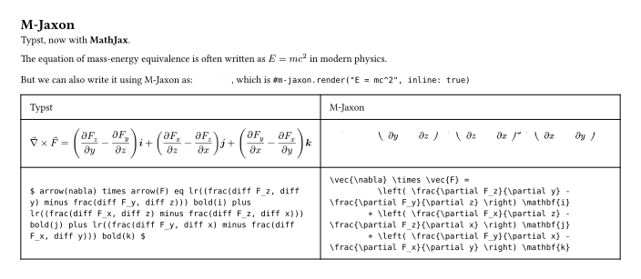

# [M-Jaxon](https://github.com/Enter-tainer/m-jaxon)

Render LaTeX equation in typst using MathJax.




````typ
#import "./typst-package/lib.typ" as m-jaxon
// Uncomment the following line to use the m-jaxon from the official package registry
// #import "@preview/m-jaxon:0.1.1"
#set page(height: auto, width: auto, margin: 2em)
#set text(size: 14pt)

= M-Jaxon

Typst, now with *MathJax*.

#let code = ```
  \vec{\nabla} \times \vec{F} =
            \left( \frac{\partial F_z}{\partial y} - \frac{\partial F_y}{\partial z} \right) \mathbf{i}
          + \left( \frac{\partial F_x}{\partial z} - \frac{\partial F_z}{\partial x} \right) \mathbf{j}
          + \left( \frac{\partial F_y}{\partial x} - \frac{\partial F_x}{\partial y} \right) \mathbf{k}
  ```
#code

#m-jaxon.render(code.text, inline: false)

The equation of mass-energy equivalence is often written as $E=m c^2$ in modern physics.

But we can also write it using M-Jaxon as: #m-jaxon.render("E = mc^2", inline: true)

````

## Limitations

- Currently the size of the equation is not adjustable and is fixed to `14pt`. This might be changed in the future.
- Even with font size `14pt`, the baseline of the inline equation still looks a bit off.


## Documentation

### `render`

Render a LaTeX equation string to an svg image. Depending on the `inline` argument, the image will be rendered as an inline image or a block image.

#### Arguments

* `src`: `str` - The LaTeX equation string
* `inline`: `bool` - Whether to render the image as an inline image or a block image
* All other arguments are passed to `image.decode` so you can customize the image size

#### Returns

The image, of type `content`
